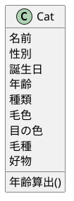
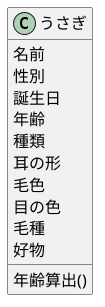
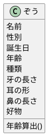
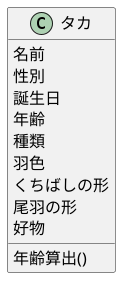
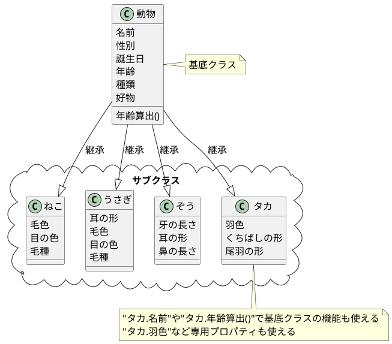
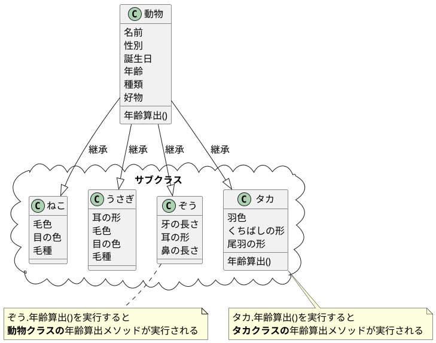

```plantuml
@startuml
skinparam {
    defaultfontsize 16
}
class Cat{
    名前
    性別
    誕生日
    年齢
    種類
    毛色
    目の色
    毛種
    好物
    年齢算出()
}
@enduml
```

```plantuml
@startuml
skinparam {
    defaultfontsize 16
}
class うさぎ {
    名前
    性別
    誕生日
    年齢
    種類
    耳の形
    毛色
    目の色
    毛種
    好物
    年齢算出()
}
@enduml
```

```plantuml
@startuml
skinparam {
    defaultfontsize 16
}
class ぞう {
    名前
    性別
    誕生日
    年齢
    種類
    牙の長さ
    耳の形
    鼻の長さ
    好物
    年齢算出()
}
@enduml
```

```plantuml
@startuml
skinparam {
    defaultfontsize 16
}
class タカ {
    名前
    性別
    誕生日
    年齢
    種類
    羽色
    くちばしの形
    尾羽の形
    好物
    年齢算出()
}
@enduml
```

```plantuml
@startuml
skinparam {
    defaultfontsize 16
}
class 動物 {
    名前
    性別
    誕生日
    年齢
    種類
    好物
    年齢算出()
}
note right
基底クラス
end note
package サブクラス <<Cloud>> {
    class ねこ {
        毛色
        目の色
        毛種
    }
    class うさぎ {
        耳の形
        毛色
        目の色
        毛種
    }
    class ぞう {
        牙の長さ
        耳の形
        鼻の長さ
    }
    class タカ {
        羽色
        くちばしの形
        尾羽の形
    }
}
note bottom
~"タカ.名前~"や~"タカ.年齢算出()~"で基底クラスの機能も使える
~"タカ.羽色~"など専用プロパティも使える
end note

動物 --|> ねこ: 継承
動物 --|> うさぎ: 継承
動物 --|> ぞう: 継承
動物 --|> タカ: 継承
@enduml
```

```plantuml
@startuml
skinparam {
    defaultfontsize 16
}
note "タカ.年齢算出()を実行すると\n**タカクラスの**年齢算出メソッドが実行される" as N1
note "ぞう.年齢算出()を実行すると\n**動物クラスの**年齢算出メソッドが実行される" as N2
class 動物 {
    名前
    性別
    誕生日
    年齢
    種類
    好物
    年齢算出()
}
package サブクラス <<Cloud>> {
    class ねこ {
        毛色
        目の色
        毛種
    }
    class うさぎ {
        耳の形
        毛色
        目の色
        毛種
    }
    class ぞう {
        牙の長さ
        耳の形
        鼻の長さ
    }
    class タカ {
        羽色
        くちばしの形
        尾羽の形
        年齢算出()
    }
}

動物 --|> ねこ: 継承
動物 --|> うさぎ: 継承
動物 --|> ぞう: 継承
動物 --|> タカ: 継承

ぞう .. N2
タカ .. N1
@enduml
```